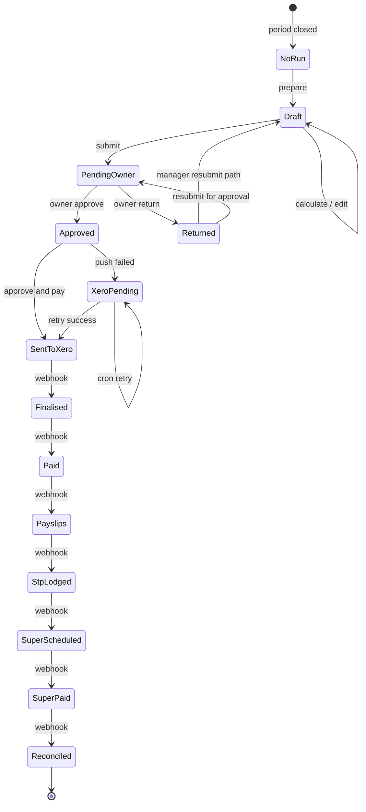

# Payroll Export — User flows

> Companion to [`plan.md`](plan.md) and [`tdd.md`](tdd.md). Aligned to [Notion Payroll Export](https://www.notion.so/34f64094bde6809fbb84e54ef1bd8269).

## 1. Happy paths

### 1.1 Pay period close → prepare payroll (Notion Flow 1)

| # | User does | UI shows | System does | Telemetry |
|---|-----------|----------|-------------|-----------|
| 1 | Opens `/workforce/payroll-export` | Recently closed period + approved timesheet count | GET pay-periods + runs | `payroll.viewed` |
| 2 | Taps **Prepare payroll** | — | POST prepare → draft pay run | `payroll.prepared` |

### 1.2 Pre-pay-run readiness check (Flow 2)

| # | User does | UI shows | System does | Telemetry |
|---|-----------|----------|-------------|-----------|
| 1 | — | Pre-flight panel loading | POST preflight | — |
| 2 | Resolves hard blocks (links to People) | Blocker list with severity | Re-run preflight on demand | `payroll.preflight_blocked` if still blocked |
| 3 | All hard blocks clear | **Continue to calculation** enabled | Log passed check | — |

### 1.3 Calculation runs (Flow 3)

| # | User does | UI shows | System does | Telemetry |
|---|-----------|----------|-------------|-----------|
| 1 | Taps **Run calculation** | Progress indicator | POST calculate; freeze snapshot | `payroll.calculated` |
| 2 | — | Summary totals + employee table | Persist line items | — |

### 1.4 Review summary + employee detail (Flows 4–5)

| # | User does | UI shows | System does | Telemetry |
|---|-----------|----------|-------------|-----------|
| 1 | Sorts/filters employee table | Gross, super, PAYG, net columns | — | — |
| 2 | Opens employee row | Detail sheet: timesheet lines, leave, penalty breakdown | GET run (FDV gated) | — |

### 1.5 Edit line item (Flow 6)

| # | User does | UI shows | System does | Telemetry |
|---|-----------|----------|-------------|-----------|
| 1 | Taps **Edit** on employee | Override dialog | — | — |
| 2 | Enters gross/PAYG/super override + reason | Validation | PATCH line | — |
| 3 | — | Override badge on row | Audit log row | — |

### 1.6 Send for Owner approval (Flow 7)

| # | User does | UI shows | System does | Telemetry |
|---|-----------|----------|-------------|-----------|
| 1 | Taps **Send for Owner approval** | Confirm | POST submit → `pending_owner_approval` | `payroll.submitted_for_approval` |
| 2 | — | Read-only for manager; Owner notified (stub) | — | — |

### 1.7 Owner approve (Flow 7)

| # | User does | UI shows | System does | Telemetry |
|---|-----------|----------|-------------|-----------|
| 1 | Owner opens same page | Summary read-only | GET run | `payroll.viewed` |
| 2 | Taps **Approve** | — | POST approve → `approved` | `payroll.approved` |

### 1.8 Approve and pay (Flow 8)

| # | User does | UI shows | System does | Telemetry |
|---|-----------|----------|-------------|-----------|
| 1 | Taps **Approve and pay** | Modal: totals, pay date, Xero tenant, warning copy | — | — |
| 2 | Confirms | Spinner | POST execute; inline Xero retry once | `payroll.xero_push_started` |
| 3 | — | Status **Sent to Xero** | Push log; on success advance status | — |

### 1.9 Xero milestones (Flow 9)

| # | User does | UI shows | System does | Telemetry |
|---|-----------|----------|-------------|-----------|
| 1 | — | Stepper updates via polling/webhook | Webhook handler advances status chain | — |
| 2 | — | **Reconciled** | Lock timesheets; set pay_period exported | `payroll.reconciled` |

### 1.10 Termination final pay (Flow 10)

| # | User does | UI shows | System does | Telemetry |
|---|-----------|----------|-------------|-----------|
| 1 | — | Employee row badge **Final pay** | Calculate termination + VIC LSL lines | — |
| 2 | Owner reviews itemised breakdown | Detail sheet | STP cessation code in snapshot | — |

### 1.11 Penalty / junior / FDV (Flows 12–14)

Covered by calculation + detail sheet display; FDV visible to Owner only; payslip mapping uses non-FDV label in Xero payload.

### 1.12 CSV / PDF export (Notion reporting)

| # | User does | UI shows | System does | Telemetry |
|---|-----------|----------|-------------|-----------|
| 1 | Taps **Download CSV** | File save | GET export.csv | — |
| 2 | Taps **Download PDF** | File save | GET export.pdf | — |

### 1.13 Correction pay run (Flow 16)

| # | User does | UI shows | System does | Telemetry |
|---|-----------|----------|-------------|-----------|
| 1 | Creates correction from locked run | Wizard: employee + back-pay amount | POST correction → new run `is_correction_run=true` | `payroll.prepared` |
| 2 | Owner executes correction | Same Approve and pay flow | Links `corrects_pay_run_id`; audit note | `payroll.reconciled` |

### 1.14 Owner send back (grill-me)

| # | User does | UI shows | System does | Telemetry |
|---|-----------|----------|-------------|-----------|
| 1 | Owner taps **Return to manager** | Notes required | POST return → `returned_for_revision` | `payroll.returned_by_owner` |
| 2 | Manager edits + **Resubmit for approval** | Return banner with notes | → `pending_owner_approval` | `payroll.submitted_for_approval` |

### 1.15 Wage Theft check (Flow 17)

| # | User does | UI shows | System does | Telemetry |
|---|-----------|----------|-------------|-----------|
| 1 | — | Hard block row per employee | Pre-flight compares rate vs award min | `payroll.preflight_blocked` |
| 2 | Owner applies exemption + reason | — | Override category `wage_theft_exemption` | — |

## 2. Error states

| Trigger | Code | HTTP | User-visible | Recovery | Telemetry | Test ref |
|---------|------|------|--------------|----------|-----------|----------|
| Crew opens payroll route | `forbidden` | 403 | Redirect / “No access” | — | `payroll.forbidden` | tdd #36 |
| Manager taps Approve and pay | `forbidden` | 403 | Toast | Owner must execute | `payroll.forbidden` | tdd #35 |
| No approved timesheets | `no_approved_timesheets` | 422 | Empty state CTA → Timesheets | Approve timesheets | — | tdd #39 |
| People profile incomplete | `preflight_hard_block` | 422 | Blocker list + People links | Fix profiles | `payroll.preflight_blocked` | tdd #23 |
| Rate below award minimum | `wage_theft_block` | 422 | Hard block copy (s327A) | Fix rate or Owner exemption | `payroll.preflight_blocked` | tdd #11 |
| Calculate on blocked run | `preflight_required` | 409 | Run pre-flight first | Run pre-flight | — | tdd #23 |
| Edit line when approved | `pay_run_locked` | 409 | Toast | — | — | tdd #16 |
| Invalid status transition | `invalid_status_transition` | 409 | Toast | Refresh state | — | tdd #13 |
| Xero not connected | `xero_not_connected` | 422 | Empty state → Integrations | Connect Xero payroll | — | tdd #39 |
| Xero no payroll subscription | `xero_payroll_unavailable` | 422 | Upgrade copy | Upgrade Xero plan | — | flows-only |
| Xero push network error | `xero_push_failed` | 502 | Toast + **Retry push** | Auto cron + manual retry | `payroll.xero_push_failed` | tdd #29 |
| Xero validation error (bad USI) | `xero_validation_error` | 422 | Detail from Xero body | Fix People super fund | `payroll.xero_push_failed` | tdd #29 |
| Webhook signature invalid | `webhook_unauthorized` | 401 | — (server) | — | — | tdd #31 |
| Stale sent_to_xero (no webhook) | — | — | Banner “Awaiting Xero confirmation” | Cron marks pending retry | — | plan §5 internal |
| Timesheet already locked | `timesheet_locked` | 409 | — | Correction run | — | tdd #33 |
| Agent attempts execute | `forbidden` | 403 | — | Human only | `payroll.forbidden` | tdd #35 |
| Server 500 | `internal_error` | 500 | Generic + support | Retry | `payroll.failed` | integration |

## 3. Alternate flows

### 3.1 Xero push retry (Notion Flow 15 + grill-me C)

- **Trigger:** Push fails after inline retry.
- **State:** `xero_push_pending`; Owner notified.
- **Behavior:** Cron backoff retries; Owner **Retry push** re-confirms; same `calculation_snapshot` digest.
- **Acceptance:** No recalculation; idempotent Xero client mock passes tdd #30.

### 3.2 Cancel mid-prepare

- **Trigger:** Navigate away from draft run.
- **State:** Draft persisted (no auto-delete in MVP — Phase 2 cancel-and-restart).
- **Acceptance:** Returning to period resumes draft; no partial Xero push.

### 3.3 Deep link

- **Route:** `/workforce/payroll-export?payRunId=…`
- **Behavior:** Page loads run by id; 404 if missing; 403 if crew.

### 3.4 Empty states (Notion)

| State | Copy / CTA |
|-------|------------|
| No approved timesheets | Link to Timesheets |
| No Xero connection | Link to Settings → Integrations |
| No payroll subscription | Xero upgrade guidance |
| Pre-first payroll | Onboarding copy |

### 3.5 Loading

- Skeleton for period list + summary cards; stepper placeholder.

### 3.6 Permissions denied

- Crew: no nav entry or 403 page if URL forced.
- Manager: no Approve and pay button; no FDV section in detail sheet.

### 3.7 Offline

- Read-only cached run if previously loaded; block execute/submit with banner.

### 3.8 Mobile

- Employee table → card list on `sm`; detail sheet full viewport; confirm modals full-width; tap targets ≥44px.

## 4. State diagram

## 5. Acceptance summary

- [ ] Notion Flows 1–17 covered in §1–§3 (Phase 2 exclusions documented in plan §2).
- [ ] Every §2 error row has tdd reference or explicit manual-only note.
- [ ] Owner send-back uses `returned_for_revision` (not generic draft).
- [ ] Approve and pay never fires without confirmation modal + capability check.
- [ ] FDV never visible to Venue Manager in UI or API DTO.
- [ ] Reconciled locks all included timesheets.
- [ ] Telemetry payloads contain no sensitive fields in production.
