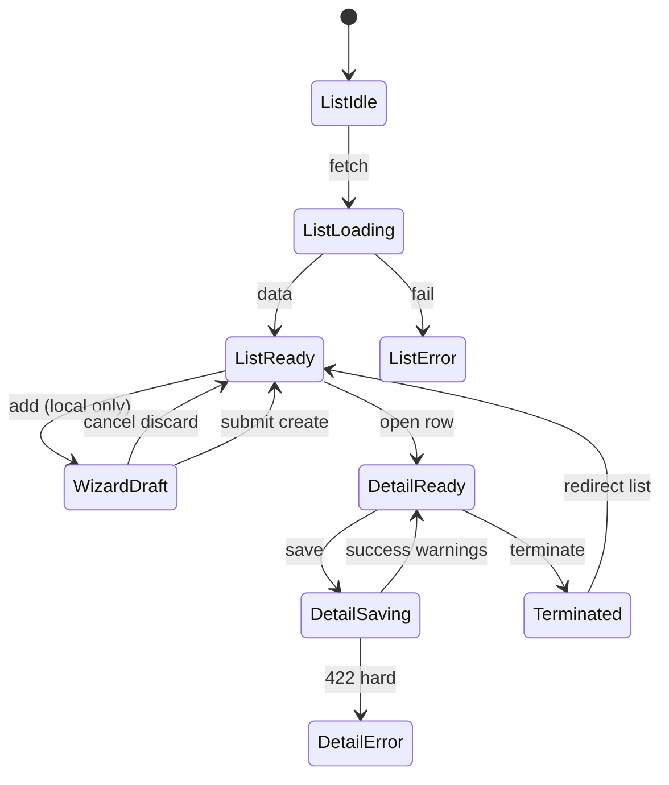

# People — User flows

> Companion to [`plan.md`](plan.md) and [`tdd.md`](tdd.md). Aligned to [Notion People](https://www.notion.so/34f64094bde6808393eee71ac4e611e8) and grill-me decisions (1 Jun 2026).

## 1. Happy paths

### 1.1 Add employee — manual entry (Owner)

| # | User does | UI shows | System does | Telemetry |
|---|-----------|----------|-------------|-----------|
| 1 | Opens `…/workforce/people` | List + “Add employee” | GET `…/workforce/people` | `people.viewed` |
| 2 | Starts wizard | Step 1 Personal | sessionStorage draft key set | — |
| 3 | Completes steps 1–7 | Step 7 Invite | Local draft only until submit | — |
| 4 | Submits | Success toast | POST `…/workforce/people` atomic create + invite | `people.employee_created` |
| 5 | — | Row on list; compliance pill | `complianceStatus` + `warnings[]` if incomplete | `people.compliance_warning` |

### 1.2 Import from Xero (initial)

| # | User does | UI shows | System does | Telemetry |
|---|-----------|----------|-------------|-----------|
| 1 | Connects Xero (onboarding/settings) | — | existing integration | — |
| 2 | Clicks Import from Xero | Preview grid | POST `…/people/import/xero` | — |
| 3 | Confirms rows | “Needs Supersolt detail” badges | POST `…/import/xero/confirm` | `people.xero_import_completed` |
| 4 | Bulk-edits venue/award on list | Inline / detail | PATCH per employee | — |

### 1.3 Edit pay rate (Owner)

| # | User does | UI shows | System does | Telemetry |
|---|-----------|----------|-------------|-----------|
| 1 | Opens detail → Employment | Current rate | GET employee | — |
| 2 | Changes rate + effective date | Award warn if below min | — | — |
| 3 | Provides override reason if warned | — | POST `…/pay-rates` | `people.pay_rate_changed` |

### 1.4 Employee self-onboarding (ESO)

| # | User does | UI shows | System does | Telemetry |
|---|-----------|----------|-------------|-----------|
| 1 | Owner sends link | — | POST `…/onboarding-link` | — |
| 2 | Employee opens `/{org}/onboard/{token}` | Public form | GET `/api/…/onboard/[token]` | — |
| 3 | Completes TFN/super/bank | — | PATCH token route | `people.eso_completed` |
| 4 | Owner notified | In-app notification (when wired) | Owner reviews before Xero push | — |

### 1.5 Staff self-edit address

| # | User does | UI shows | System does | Telemetry |
|---|-----------|----------|-------------|-----------|
| 1 | Opens `…/workforce/people/me` | Own detail | GET `…/people/me` | — |
| 2 | Edits address | Saves | PATCH allowed fields | — |

### 1.6 Terminate employee (Owner)

| # | User does | UI shows | System does | Telemetry |
|---|-----------|----------|-------------|-----------|
| 1 | Terminate dialog | Final-pay stub lines | — | — |
| 2 | Confirms | — | POST `…/terminate` | `people.employee_terminated` |
| 3 | — | Removed from active filter | User deactivated; record retained | — |

### 1.7 Venue directory (roster consumer)

| # | User does | UI shows | System does | Telemetry |
|---|-----------|----------|-------------|-----------|
| 1 | Roster loads staff pickers | — | GET `…/venues/[venue]/people` | — |

## 2. Error states

| Trigger | `code` | HTTP | User-visible state | Recovery | Telemetry | Test |
|---------|--------|------|-------------------|----------|-----------|------|
| Duplicate email on create | `duplicate_email` | 422 | Inline on email field | Use different email / link existing | `people.failed` | tdd #15 |
| Below award min, no override | `award_minimum_override_required` | 422 | Red banner + reason field | Enter reason or raise rate | `people.failed` | tdd #16 |
| Invalid STP tax code format | `invalid_tax_treatment_code` | 422 | Inline | Fix code | `people.failed` | tdd #6 |
| Not org member | `forbidden` | 403 | Toast | — | `people.failed` | route |
| Venue manager opens colleague sensitive | `forbidden` | 403 | Read-blocked section copy (flow 13) | Ask employee or Owner | `people.failed` | tdd #20,23 |
| Crew edits colleague | `forbidden` | 403 | Toast | — | `people.failed` | tdd #4 |
| Archive with active roster shifts | `roster_assignment_warning` | 200 | Warning banner; allow archive | Remove from roster first | `people.compliance_warning` | integration |
| Terminate with future shifts | `future_roster_shifts` | 409 | Dialog lists shifts | Unassign then retry | `people.failed` | integration |
| Xero import empty | `xero_import_empty` | 200 | Empty state in dialog | Manual add | `people.failed` | route |
| Xero OAuth missing payroll scope | `xero_payroll_scope_required` | 403 | Reconnect CTA | Settings → Integrations | `people.failed` | open |
| CSV row invalid | `csv_row_errors` | 422 | Preview highlights rows | Fix file | `people.failed` | tdd #7 |
| ESO token expired | `onboard_token_expired` | 410 | “Link expired” | Request new link | `people.failed` | tdd #17 |
| ESO token invalid | `onboard_token_invalid` | 404 | Generic error | — | `people.failed` | tdd #17 |
| VEVO incomplete on save | `vevo_incomplete` | 200 | Amber compliance + warning | Complete VEVO tab | `people.compliance_warning` | tdd #14 |
| FWIS date missing | `fwis_missing` | 200 | Amber compliance | Record date | `people.compliance_warning` | tdd #1 |
| Network failure | — | — | Toast + retry | Retry | `people.failed` | e2e |
| Server 500 | `internal_error` | 500 | Support code | Retry | `people.failed` | route |

**Tiered validation (grill-me #8):** compliance gaps → success + warnings; structural/duplicate/award-without-override → 422.

## 3. Alternate flows

### 3.1 Cancel wizard (local draft)

- **Trigger:** Close wizard or navigate away mid-flow.
- **Storage:** `sessionStorage` key `people-add-draft:{orgId}`; no server row.
- **UI:** Confirm if dirty.
- **Acceptance:** No employee in list until step 7 submit.

### 3.2 Retry

- **Trigger:** Failed POST/PATCH.
- **Behaviour:** Idempotent client request key on create; retry toast.
- **Acceptance:** No duplicate `user_organisations` row.

### 3.3 Xero partial completion

- **Trigger:** Imported row with `needs_supersolt_detail`.
- **UI:** Badge + filter pill.
- **Acceptance:** Roster may warn; payroll pre-flight blocks until complete.

### 3.4 Deep link

- **Entry:** `…/workforce/people/[userOrganisationId]`
- **Behaviour:** Server fetch; 404 if missing; 403 if not authorized; sensitive tab hidden per role.

### 3.5 Empty states

| Surface | Copy |
|---------|------|
| No employees | “No employees added. Import from Xero or add manually.” |
| Post-onboarding gaps | Checklist: TFN, super, FWIS, VEVO |
| Filter empty | “No employees match this filter” |

### 3.6 Loading

- Table skeleton; detail tab skeletons; no layout shift.

### 3.7 Permissions denied

- Staff visiting another employee’s detail → 403 page.
- Sensitive tab not rendered for venue manager.

### 3.8 Offline

- Online-only; submit disabled with banner (no write queue in MVP).

### 3.9 Mobile

- List cards below `md`; wizard full-screen steps; tap targets ≥44px.

## 4. State diagram

## 5. Acceptance summary

- [ ] All §1 happy paths pass E2E or documented manual smoke.
- [ ] Every §2 row has a test in [`tdd.md`](tdd.md).
- [ ] §3 alternates verified (wizard draft, Xero partial, sensitive block).
- [ ] Telemetry fires without sensitive payloads.
- [ ] Parent [`workforce/plan.md`](../plan.md) child row marked **specced**.
