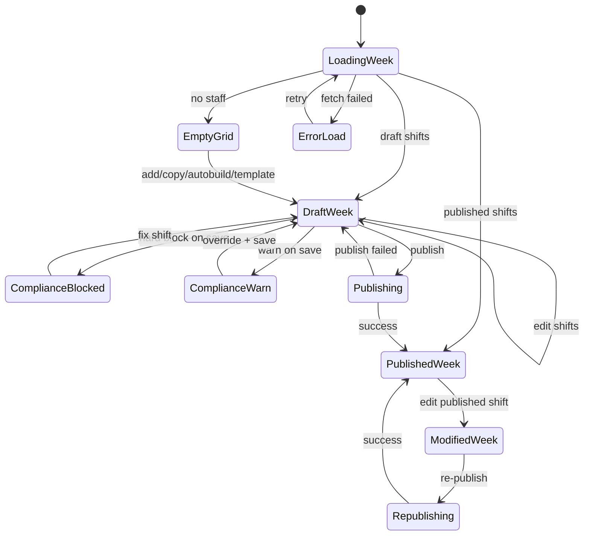
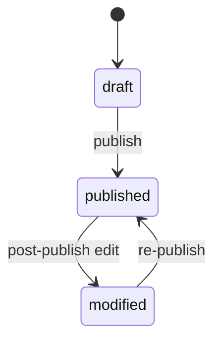

# Roster — User flows

> Companion to [`plan.md`](plan.md) and [`tdd.md`](tdd.md). Maps [Notion Roster](https://www.notion.so/34f64094bde680a2a2f8e7a582110aab) flows to UI states and tests.

## 1. Happy paths

### 1.1 Build the week against demand (Notion #1)

| # | User does | UI shows | System does | Telemetry |
|---|-----------|----------|-------------|-----------|
| 1 | Opens Roster for next week | Week grid + cost summary skeleton | GET week + overlay + budget | `roster.viewed` |
| 2 | Reviews hourly demand curve under days | Demand bars + “learning” if no forecast | GET forecast-overlay | — |
| 3 | Taps **Copy last week** | Shifts copied as Draft | POST copy-week | `roster.shift_created` |
| 4 | Drags/resizes a shift | Live cost chip updates | PATCH shift + recompute cost | — |
| 5 | Resolves amber budget / compliance flags | Banners on shift rows | Compliance re-eval | — |
| 6 | Taps **Publish** | Confirm dialog with totals | POST publish → email/PDF queue | `roster.published` |
| 7 | — | Toast “Roster published” | Timesheet baselines created | — |

### 1.2 AI auto-build (Notion #2)

| # | User does | UI shows | System does | Telemetry |
|---|-----------|----------|-------------|-----------|
| 1 | Taps **Auto-build**, picks week | Progress indicator | POST auto-build | — |
| 2 | — | Draft grid + summary card (“Built to $X / Y%…”) | Inserts draft shifts `source=autofill` | `roster.auto_build` |
| 3 | Edits draft shifts | Standard edit flow | PATCH shifts | — |
| 4 | Publishes | Same as §1.1 step 6 | Never auto-publishes from auto-build | `roster.published` |

### 1.3 Cost a shift as placed (Notion #3)

| # | User does | UI shows | System does |
|---|-----------|----------|-------------|
| 1 | Adds Sunday casual shift | Shift chip with total $ | Award pipeline prices shift |
| 2 | Hovers chip | Tooltip: base vs penalty + rule label | — |
| 3 | — | Day/week footer totals update | Aggregate `roster_weeks` costs |

### 1.4 Publish + deliver (Notion #6)

| # | User does | UI shows | System does |
|---|-----------|----------|-------------|
| 1 | Publish draft week | Published badge on shifts | lifecycle → published |
| 2 | — | — | Per-employee email queued |
| 3 | — | Download PDF link (manager) | Full-venue PDF generated |
| 4 | Edits published shift later | Modified-after-publish banner | state → modified |
| 5 | Re-publish | Confirm affected staff count | Re-notify affected only |

### 1.5 Enter actuals handoff (Notion #7)

| # | User does | UI shows | System does |
|---|-----------|----------|-------------|
| 1 | Navigates to Timesheets next week | Rows pre-filled from roster | Published shifts → `timesheets` |
| 2 | Accept-as-rostered or edit actuals | Standard timesheet UI | PATCH timesheets (separate module) |

### 1.6 Coverage gap + SPLH (Notion #8)

| # | User does | UI shows | System does |
|---|-----------|----------|-------------|
| 1 | Opens cost summary | SPLH Planned + under-covered hours | Compute forecast sales ÷ rostered hours |
| 2 | — | Link to Labour Insights (when live) | Write aggregate snapshot |

## 2. Error states

| Trigger | User-visible state | Recovery | Telemetry | Test ref |
|---------|-------------------|----------|-----------|----------|
| Required shift fields missing | Inline validation on sheet | Fill fields | — | tdd #17 |
| Hard-block: approved leave | Blocking alert; save disabled | Choose another staff/day | `roster.compliance_blocked` | tdd #4, #10 |
| Hard-block: missing/expired cert | Same | Assign qualified staff | `roster.compliance_blocked` | tdd #4 |
| Hard-block: under-18 / visa | Same | Remove or reassign shift | `roster.compliance_blocked` | tdd #4 |
| Warn: rest gap / max hours / availability / budget / min engagement | Amber banner + override reason field | Enter reason → save | `roster.compliance_overridden` | tdd #5, #11 |
| Same-day overlap (existing) | Toast: already has shift that day | Edit existing shift | — | baseline |
| Auth missing / expired | Redirect to sign-in | Sign in | `auth.expired` | flows-only |
| Staff role access | 403 or redirect to crew surface | — | `roster.forbidden` | tdd #13 |
| Venue not found | 404 page | Switch venue | `roster.failed` | integration |
| Network failure on week load | Error banner + retry | Retry fetch | `roster.failed` | tdd #15 |
| Publish email failure | Toast partial success + delivery log | Retry publish / contact support | `roster.failed` | tdd #12 |
| Auto-build no eligible staff | Summary: “0 shifts placed” + reasons | Manual build | `roster.auto_build` | tdd #7 |
| Forecast unavailable | Overlay placeholder copy | Build without overlay | — | tdd #16 |

## 3. Alternate flows

### 3.1 Cancel shift edit

- **Trigger:** Close sheet or Cancel.
- **State:** Confirm if dirty.
- **Acceptance:** No PATCH; draft unchanged.

### 3.2 Retry failed week load

- **Trigger:** Retry on error banner.
- **Acceptance:** Idempotent GET; no duplicate shifts.

### 3.3 Draft partial work

- **Trigger:** Navigate away mid-week.
- **Storage:** Draft shifts persisted in DB (`lifecycle=draft`).
- **Acceptance:** Return restores same week draft via `lifecycle=draft` query.

### 3.4 Deep link

- **Example:** `…/workforce/roster?weekStart=2026-06-01`
- **Behavior:** Server/client loads that ISO Monday week.
- **Acceptance:** Invalid date → default to current week + toast.

### 3.5 Empty states (Notion)

| Condition | UI |
|-----------|-----|
| No staff | “Add your team in People” + link |
| No forecast | “Demand overlay turns on once…” + build anyway |
| First roster | “Build from scratch, copy a template, or Auto-build” |

### 3.6 Loading

- Skeleton grid matching week/day layout within 100ms of navigation.

### 3.7 Permissions denied

- Staff authenticated: no roster management actions; redirect per `getStaffDashboardRedirectPath` when crew-only (future: read-only own shifts in P2).

### 3.8 Offline

- Banner if offline; block publish/submit; allow read cached week if previously loaded.

### 3.9 Mobile / small viewport

- Stack day view default under `md`; tap targets ≥44px; shift edit uses full-screen sheet.

### 3.10 Open shift assignment

- **Trigger:** Click unassigned shift → pick staff.
- **Acceptance:** Compliance runs on assignment; open shift → assigned shift.

### 3.11 Template apply

- **Trigger:** Templates menu → apply to week.
- **Acceptance:** Template shifts inserted as draft; source `template_apply`.

## 4. State diagram

### Roster week states

## 5. Acceptance summary

Phase 1 Roster matches Notion when:

- [ ] Flows §1.1–§1.6 implemented with passing tests in `tdd.md`
- [ ] Hard blocks in §2 never savable without fix
- [ ] Warn tier requires override reason + audit row
- [ ] Auto-build never auto-publishes
- [ ] Mock costing removed; server cost DTO drives UI
- [ ] Publish sends email + PDF; respects quiet hours
- [ ] Published shifts create Timesheet baselines
- [ ] SPLH Planned available in cost summary (Labour Insights feed may follow)
- [ ] Empty states §3.5 match Notion copy intent
- [ ] Staff have no Phase 1 roster UI access

## 6. Manual smoke (if no Playwright)

1. Sign in as venue manager → open Roster → confirm week loads with staff rows.
2. Add shift → confirm cost appears (not hash mock).
3. Place shift on staff with approved leave → confirm hard block.
4. Place shift with rest gap → override with reason → confirm saves.
5. Publish → check email log / PDF download.
6. Open Timesheets → confirm baseline row for published shift.
