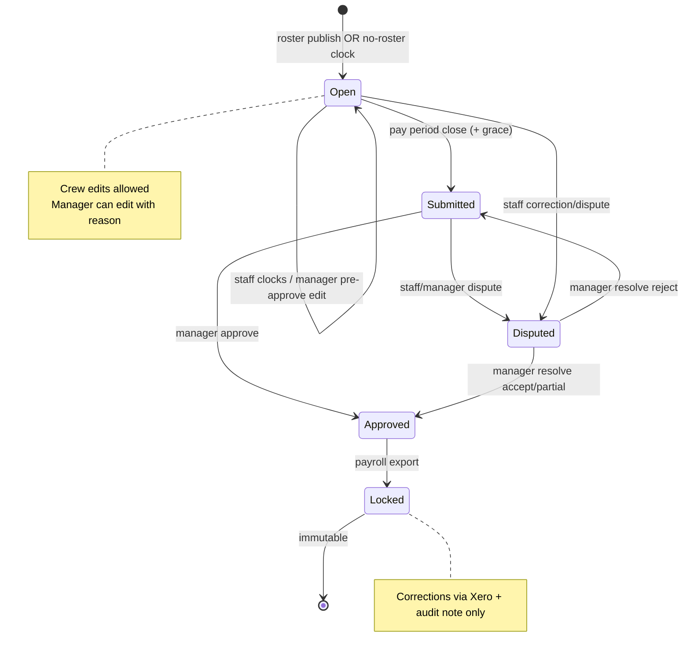
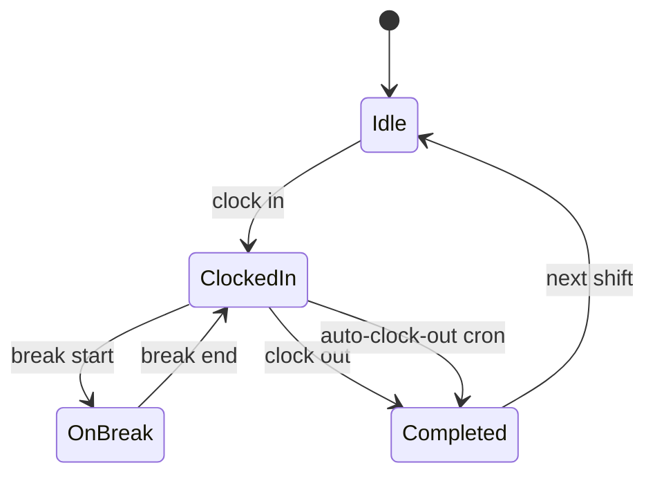

# Timesheets — User flows

> Companion to [`plan.md`](plan.md) and [`tdd.md`](tdd.md). Aligned to [Notion Timesheets](https://www.notion.so/34f64094bde68098a187cddc4c51b467).

## 1. Happy paths

### 1.1 Staff clock in (standard)

| # | User does | UI shows | System does | Telemetry |
|---|-----------|----------|-------------|-----------|
| 1 | Opens `/workforce/timesheets` (staff surface) | Large "Clock In" + today's shift card | GET active clock + today's rostered shift | `timesheets.viewed` |
| 2 | Taps Clock In | Spinner → confirmation toast | POST clock-in; records event; sets `actual_starts_at` | `timesheets.clock_in` |
| 3 | — | Banner "Clocked in since …" + Break / Clock Out CTAs | Background geolocation validate if enabled | — |

### 1.2 Staff clock out

| # | User does | UI shows | System does | Telemetry |
|---|-----------|----------|-------------|-----------|
| 1 | Taps Clock Out at shift end | Confirm if >30 min late vs rostered end | POST clock-out | — |
| 2 | Confirms if prompted | "Clocked out · X hrs worked" | Computes actual hours, variance tiers | `timesheets.clock_out` |
| 3 | — | Shift in history as Completed | Status remains Open until period close | — |

### 1.3 Break logging

| # | User does | UI shows | System does | Telemetry |
|---|-----------|----------|-------------|-----------|
| 1 | Taps Start break before lunch | "On break since …" banner | POST break-start event | — |
| 2 | Taps End break after lunch | Returns to clocked-in banner | POST break-end; updates unpaid break total | — |

### 1.4 Missed clock-in correction

| # | User does | UI shows | System does | Telemetry |
|---|-----------|----------|-------------|-----------|
| 1 | Opens completed shift missing start | "Submit correction" CTA | — | — |
| 2 | Enters claimed start + note | Form validation | POST correction → dispute/correction flow | `timesheets.disputed` |
| 3 | — | Pending manager review | Manager notified (event stub) | — |

### 1.5 Auto-clock-out (cron)

| # | User does | UI shows | System does | Telemetry |
|---|-----------|----------|-------------|-----------|
| 1 | Forgets clock out, leaves venue | — | Cron: >1 hr past rostered end → auto clock at rostered end | `timesheets.auto_clock_out` |
| 2 | Opens app next session | Banner: verify end time | `is_auto_clocked=true` | — |
| 3 | Submits correction if needed | Correction form | Updates via dispute/correction | — |

### 1.6 Pay period close → submitted

| # | User does | UI shows | System does | Telemetry |
|---|-----------|----------|-------------|-----------|
| 1 | — (period end) | — | Cron: Open entries → Submitted after 24 hr grace | `timesheets.period_closed` |
| 2 | Manager opens timesheets | Pipeline bar: N submitted | GET entries filtered submitted | `timesheets.viewed` |

### 1.7 Manager bulk approve clean matches

| # | User does | UI shows | System does | Telemetry |
|---|-----------|----------|-------------|-----------|
| 1 | Filters "Clean matches" | ~N rows within tolerance | GET with filter | — |
| 2 | Select all + Bulk approve | Progress | POST bulk-approve | `timesheets.bulk_approved` |
| 3 | — | Status Approved pills | Each triggers accrual idempotently | `leave.accrual_posted` |

### 1.8 Manager reviews variance

| # | User does | UI shows | System does | Telemetry |
|---|-----------|----------|-------------|-----------|
| 1 | Filters variance >15 min | Red variance badges | GET filtered list | — |
| 2 | Opens detail | Schedule vs Actual side-by-side | GET entry + audit | — |
| 3 | Approves as-is OR edits with reason | Edit dialog requires reason | POST approve or PATCH edit | `timesheets.approved` / `timesheets.edited` |

### 1.9 Staff dispute

| # | User does | UI shows | System does | Telemetry |
|---|-----------|----------|-------------|-----------|
| 1 | Taps Dispute on entry | Form: claimed times + notes | — | — |
| 2 | Submits | Status Disputed | POST dispute | `timesheets.disputed` |
| 3 | Manager resolves Accept | Staff notified | POST resolve accepted | `timesheets.dispute_resolved` |

### 1.10 Approval → leave accrual

| # | User does | UI shows | System does | Telemetry |
|---|-----------|----------|-------------|-----------|
| 1 | Manager approves 8 hr FT shift | — | `postTimesheetAccrual` | `leave.accrual_posted` |
| 2 | Staff opens Leave | Balance +0.58 hr annual (7.3%) | Idempotent accrual events | — |

### 1.11 Locked after payroll export

| # | User does | UI shows | System does | Telemetry |
|---|-----------|----------|-------------|-----------|
| 1 | Payroll Export includes timesheet | — | Sets `locked`, `locked_at`, export FK | `timesheets.locked` |
| 2 | Manager tries edit | "Locked — paid" | 409 | — |

### 1.12 No-roster clock-in

| # | User does | UI shows | System does | Telemetry |
|---|-----------|----------|-------------|-----------|
| 1 | Clocks in at venue without rostered shift | Warning: manager review required | Creates `is_no_roster` entry | `timesheets.clock_in` |
| 2 | Manager reviews | Flagged row in "Needs review" | Approve or edit | `timesheets.approved` |

### 1.13 Geolocation warn (optional org setting)

| # | User does | UI shows | System does | Telemetry |
|---|-----------|----------|-------------|-----------|
| 1 | Clocks in from >100 m away | "You don't appear to be at the venue" | `geolocation_flagged=true` | — |
| 2 | Confirms proceed | Clock succeeds | Manager sees flag on approve | — |

### 1.14 Multi-venue same day

| # | User does | UI shows | System does | Telemetry |
|---|-----------|----------|-------------|-----------|
| 1 | Clock in/out at venue A morning | Entry A | Separate timesheet rows | — |
| 2 | Clock in/out at venue B evening | Entry B | Same user, different venue_id | — |
| 3 | Payroll sums day | — | Two payroll lines in period | — |

### 1.15 Owner escalation (MVP-light)

| # | User does | UI shows | System does | Telemetry |
|---|-----------|----------|-------------|-----------|
| 1 | Manager hits >2 hr variance | "Requires owner approval" | 403 on manager approve | `timesheets.failed` |
| 2 | Owner approves | — | POST approve as owner | `timesheets.approved` |

### 1.16 Anomaly alerts (MVP-light)

| # | User does | UI shows | System does | Telemetry |
|---|-----------|----------|-------------|-----------|
| 1 | Manager opens timesheets | Badge: "Chronic lateness — Alex" | GET anomalies | — |
| 2 | Drills into employee | Filtered list | — | — |

## 2. Error states

| Trigger | `code` | HTTP | User-visible state | Recovery | Telemetry | Test |
|---------|--------|------|-------------------|----------|-----------|------|
| Not venue member | `forbidden` | 403 | Toast + redirect | Switch venue | `timesheets.forbidden` | tdd #31 |
| Crew views manager bulk bar | `forbidden` | 403 | Staff surface only | — | `timesheets.forbidden` | tdd #32 |
| Clock in with no active shift and geo required off-roster | `no_roster_review_required` | 200 | Warning banner | Manager approve later | — | tdd #19 |
| Clock out without clock in | `no_active_clock` | 422 | Toast | Clock in or correction | `timesheets.failed` | tdd #18 |
| Double clock in | `already_clocked_in` | 409 | Toast | Clock out first | `timesheets.failed` | integration |
| Edit locked timesheet | `timesheet_locked` | 409 | "Paid — contact payroll" | Xero adjustment note | `timesheets.failed` | tdd #30 |
| Edit submitted without manager role | `forbidden` | 403 | Read-only detail | — | `timesheets.forbidden` | tdd #15 |
| Approve without reason on disputed | `dispute_pending` | 422 | Resolve dispute first | Open dispute panel | `timesheets.failed` | tdd #28 |
| Manager approve above variance threshold | `owner_approval_required` | 403 | Escalate CTA | Owner approves | `timesheets.failed` | tdd #34 |
| Edit without reason | `reason_required` | 422 | Inline on dialog | Enter reason | `timesheets.failed` | tdd #27,43 |
| Bulk approve includes non-clean | `bulk_not_eligible` | 422 | Toast lists skipped ids | Filter clean only | `timesheets.failed` | tdd #26 |
| Pay period not open for clock | `period_closed` | 422 | "Pay period closed" | Manager edit | `timesheets.failed` | integration |
| Geolocation denied by browser | `geolocation_unavailable` | 200 | Clock proceeds; note in audit | — | — | flows-only |
| Network failure on clock | — | — | Toast + retry; optimistic time kept | Retry sync | `timesheets.failed` | tdd #38 |
| Server 500 | `internal_error` | 500 | Generic + support | Retry | `timesheets.failed` | integration |
| Invalid status transition | `invalid_status_transition` | 409 | Toast | Refresh | `timesheets.failed` | integration |

## 3. Alternate flows

### 3.1 Cancel / dirty form

- **Trigger:** Close edit/dispute sheet with unsaved fields.
- **UI:** Confirm discard.
- **Acceptance:** No PATCH/POST; no audit row.

### 3.2 Retry (slow network / optimistic clock)

- **Trigger:** Clock POST fails after optimistic UI update.
- **UI:** Toast "Sync failed — retrying" + manual Retry.
- **Behavior:** Client retains `client_event_id` for idempotent server dedupe.
- **Acceptance:** No duplicate clock events on retry.

### 3.3 Deep link

- **Entry:** `/workforce/timesheets?timesheetId={uuid}` or `?payPeriodId=`
- **Behaviour:** Opens detail sheet if authorized; 404 missing; 403 wrong venue/role.
- **Acceptance:** Agent suggestion handoff from dashboard works (replace dummy `AGENT_REFERENCE_TIMESHEET_IDS`).

### 3.4 Empty states (Notion)

| Surface | Copy |
|---------|------|
| Staff, no rostered shift | "No shifts to clock in for. Check with your manager about your roster." |
| Staff, brand-new employee | "Welcome — your first shift's timesheet will appear here once rostered." |
| Manager, no activity in period | "No timesheet activity this pay period." |
| Manager, all approved | "All timesheets approved for this period." |

### 3.5 Loading

- **UI:** Skeleton matching staff clock home or manager table layout.
- **Acceptance:** No layout shift; active clock banner loads within first paint after auth.

### 3.6 Permissions denied

- **UI:** Staff never sees team rows; manager never sees other venues without scope.
- **Acceptance:** API enforces even if UI mis-rendered.

### 3.7 Offline / flaky network

- **UI:** Banner when offline; clock buttons queue with visible "Pending sync".
- **Behavior:** Read cached active clock; block approve actions offline.
- **Acceptance:** No unhandled throw; staff can complete clock when back online.

### 3.8 Mobile / small viewport

- **Breakpoint:** `sm` (640px) — staff surface default mobile-first.
- **Adjustments:** Full-width clock CTAs ≥44px; manager table → card list on narrow.
- **Acceptance:** No horizontal scroll on iPhone SE width.

### 3.9 Early / late clock confirmation

- **Trigger:** Clock in >15 min before rostered start; clock out >30 min after rostered end.
- **UI:** Confirm dialog with delta minutes.
- **Acceptance:** Cancel leaves no event; confirm records with audit note.

### 3.10 Pay period grace (24 hr)

- **Trigger:** Period ended but within grace window.
- **Behavior:** Staff may still clock/correct; after grace cron sets Submitted.
- **Acceptance:** Edits blocked once Submitted unless manager.

## 4. State diagram

### Clock session sub-state (staff UI)

## 5. Acceptance summary

This feature is "done" when:

- [ ] Every row in §1 (happy paths 1.1–1.16) has a passing test or documented manual smoke step.
- [ ] Every row in §2 (errors) has a passing test in [`tdd.md`](tdd.md).
- [ ] Every alt flow in §3 has documented acceptance and verification.
- [ ] State diagrams in §4 match implementation.
- [ ] Demo `SEED_TIMESHEETS` removed; all data from API.
- [ ] Roster publish creates baselines; approve triggers leave accrual (cross-module smoke with Leave).
- [ ] Org timesheet settings persist and affect tolerance / geolocation / pay period.
- [ ] Crons registered in `vercel.json` and covered by integration tests.
- [ ] Telemetry events fire per [`plan.md`](plan.md) §9.
