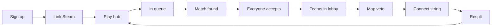

# Project brief: CS2 matchmaking website

## The request

A client wants a **Counter-Strike 2 matchmaking website** in the spirit of Faceit: players sign up, link Steam, queue for a game, accept when a match is found, see teams in a lobby, veto maps, then receive a server connect string and a simple result screen afterward.

The client is not prescribing implementation details. They are issuing **phased requirements**—the way a real stakeholder might. Each phase states what they need, which parts of the stack to use, and how they will know the phase is complete.

The developer delivers this in a **standalone project** (own GitHub repository, own Supabase project, deployable demo).

---

## Agreed stack

The client has approved this toolkit:

| Purpose                          | Technology                                                                                      |
| -------------------------------- | ----------------------------------------------------------------------------------------------- |
| Web application                  | **Next.js** (App Router)                                                                        |
| Hosting (optional)               | **Vercel**                                                                                      |
| UI                               | **shadcn/ui** and **Tailwind CSS**                                                              |
| Accounts, database, live updates | **Supabase** (Auth, Postgres, Realtime)                                                         |
| Language and input checking      | **TypeScript**, **Zod** (recommended)                                                           |
| Automated checks                 | **Vitest** (small set of tests)                                                                 |
| Version control                  | **Git**, **GitHub**, [**Conventional Commits**](https://www.conventionalcommits.org/en/v1.0.0/) |

API shape and database table names remain up to the developer. For **where code lives in the repo**, use the folder composition guide below.

### Commit messages

The client expects a readable Git history: **one logical change per commit**, with messages following [Conventional Commits](https://www.conventionalcommits.org/en/v1.0.0/).

Format: `type(scope): short description`

Common types:

| Type       | Use when                                    |
| ---------- | ------------------------------------------- |
| `feat`     | New behavior or screen the client asked for |
| `fix`      | Something broken is corrected               |
| `chore`    | Tooling, config, dependencies, folder setup |
| `docs`     | README or project documentation only        |
| `test`     | Adding or updating automated tests          |
| `refactor` | Restructure without changing behavior       |

Examples: `feat(auth): add sign up with first and last name`, `feat(queue): join and leave queue endpoints`, `fix(veto): reject ban when not captain`.

Avoid vague messages (`wip`, `updates`, `fix stuff`). Tie commits to phases where it helps review.

---

## Folder composition guide

This is a **reference layout** for keeping the project organized as it grows. Names can vary slightly; the roles should not.

```
your-project/
├── app/                      # Routes and layouts only — keep pages thin
│   └── api/                  # Server endpoints (queue, matches, auth callbacks, etc.)
├── entities/
│   └── matchmaking/          # Everything specific to queues, lobbies, veto, matches
│       ├── components/       # UI tied to matchmaking screens
│       └── lib/              # Schemas, helpers, types for this domain
├── components/               # App-wide shell only (header, nav, footer, layout chrome)
├── utils/
│   └── supabase/             # Browser client, server client, admin/service client
├── lib/                      # Small shared utilities used across the app (optional)
├── supabase/
│   └── migrations/           # Database schema changes, in order
└── types/                    # Generated or hand-written shared types (optional)
```

| Folder                     | What belongs here                                                                                                                    |
| -------------------------- | ------------------------------------------------------------------------------------------------------------------------------------ |
| **`app/`**                 | URLs the user visits. Pages should mostly compose components from `entities/` and `components/`, not hold all the business logic.    |
| **`app/api/`**             | Actions the frontend triggers on the server (join queue, accept match, ban map, etc.).                                               |
| **`entities/<domain>/`**   | One folder per major product area (here: **matchmaking**). Domain screens, hooks, validation, and rules for that area live together. |
| **`entities/.../lib/`**    | Pure logic inside a domain: team balancing, “whose turn to veto”, allowed match states—easy to test without the UI.                  |
| **`components/`**          | Branding and chrome reused on many pages. **Not** a dumping ground for every feature screen.                                         |
| **`utils/supabase/`**      | All Supabase client setup in one place so auth and database access stay consistent.                                                  |
| **`lib/`**                 | Generic helpers that are not tied to matchmaking (date formatting, small shared constants).                                          |
| **`supabase/migrations/`** | The canonical history of the database schema.                                                                                        |

**Rules of thumb**

- If it is only about queues, matches, or veto, it probably belongs under **`entities/matchmaking/`**.
- If it is navigation or “the frame around every page”, it belongs in **`components/`**.
- If it decides match rules or talks to the database on behalf of a match, prefer the **server** (`app/api/` or server-only modules)—not scattered across client components.

Phase A pass criteria can include aligning the repo with this guide (create the folders; move code there as features land).

---

## Product summary

- **Default match size:** 2v2 (four players). The client wants the required player count to be **configurable** so testing with fewer people is possible without rebuilding the product.
- **Guests** (not signed in) may view matches that are **in progress** or **finished**. They **cannot** join the queue.
- **Queueing** requires a signed-in account with **Steam linked**.
- **No real game server** is in scope: the connect string can point at a placeholder; the site orchestrates the lobby, not the match on the server.
- **Single source of truth:** whatever phase the match is in (queue, accept, lobby, veto, connect, done) must be authoritative in the backend so all players see the same state—not independent guesses in each browser.
- **Active match follows the player:** if someone is in a live match (not finished or cancelled), closes the browser, and signs in again later, the app must show they are **still in that match** and take them back into the right step—not the empty play screen.
- **One match at a time:** a player **cannot join the queue** while they are already in an active match. Queue is only for players who are not currently tied to a live game.
- **Identity in matches:** sign-up **first and last name** are for the account, not for the game lobby. Anywhere players see each other in a match (lobby team cards, accept screen, veto, server phase), show each player’s **Steam persona name (alias)** and **Steam avatar** from data captured when Steam was linked—not their legal-style signup name.



---

## How to work through this document

1. Complete phases **in order** unless the client agrees to reorder something.
2. Treat each **Pass criteria** section as the client’s acceptance test for that phase.
3. When a requirement is unclear, document assumptions in the README and proceed—real clients rarely specify everything upfront.
4. Do not skip security and permissions because they are not repeated in every phase; they apply throughout.

---

## Prerequisites

- [ ] GitHub account and basic version control
- [ ] Node.js installed locally
- [ ] Comfort building a REST-style backend and a React frontend (e.g. after an introductory full-stack course)
- [ ] Supabase account (free tier is fine)

---

## Phase A — Application foundation

**Client says:** “We need a proper web project in source control. It should run on a developer machine, look professional enough for demos, and never leak secrets into the repository. Someone new should be able to clone it and get started from the README.”

**Stack for this phase:** Next.js, shadcn/ui, Tailwind, Git, GitHub.

**Pass criteria**

- [ ] Application starts locally with steps documented in the README
- [ ] Code is on GitHub; sensitive values live only in a local environment file; a committed example file shows which variables exist (placeholders only)
- [ ] A basic site shell exists (navigation or layout) so later features have a clear home
- [ ] Top-level folders match the composition guide (empty folders are fine at first)

---

## Phase B — Accounts, Steam, and access rules

**Client says:**

- “New users register with **first name**, **last name**, and **email and password**.”
- “After they sign in, they must be able to **connect a Steam account**. We need Steam for identity in matchmaking; we are not building Counter-Strike itself. When they connect Steam, **save their public Steam display name and avatar** so the site can show the right face and alias in matches later.”
- “**First and last name from registration** are for the account (settings, billing vibe, whatever)—**not** what other players should see in the match lobby. In the lobby and anywhere else players are listed during a game, use **Steam alias and Steam avatar** only.”
- “**Permissions matter:**
  - Visitors who are **not signed in** cannot queue. They **can** browse matches that are **live** or **finished** (view only).
  - Signed-in users **without Steam** cannot queue either.
  - Only signed-in users **with Steam linked** may use matchmaking and the queue (once that exists).”

The client leaves layout and screen flow to the developer, but expects it to be obvious when Steam still needs to be connected.

**Stack for this phase:** Supabase Auth, Supabase database for profiles, Steam account linking (public Steam sign-in / OpenID pattern).

**Pass criteria**

- [ ] Registration captures first name, last name, email, and password; names appear in the product somewhere appropriate
- [ ] Sign out and sign in work reliably
- [ ] Steam can be linked once; the profile clearly shows Steam is connected
- [ ] Linking Steam stores enough profile data to show that player’s **alias and avatar** elsewhere in the app (at minimum for match screens)
- [ ] A visitor who is not signed in cannot queue (once the queue exists) but can view in-progress and completed matches
- [ ] A signed-in user without Steam cannot queue

---

## Phase C — Data for queues and matches

**Client says:** “Store everything required to run matchmaking: who is waiting, each match and what stage it is in, who is on which team, who accepted, who may ban maps, the map pool, and a record of bans. Persist **Steam alias and avatar** (or references to them) on the player profile so match UIs do not depend on signup first/last name. If you want skill ratings for fair teams, add that. Seed the maps so veto always has enough choices. Lock down the database so random visitors cannot tamper with results.”

**Stack for this phase:** Supabase Postgres, schema migrations, row-level security (or equivalent access control the client can understand in a demo).

**Pass criteria**

- [ ] A fresh database can be created from scratch using the project’s migration or setup process
- [ ] A map pool exists in the system
- [ ] A short diagram or README section explains the main entities and how they relate
- [ ] Unauthorized users cannot alter match or queue outcomes through the website alone

---

## Phase D — Server-side matchmaking logic

**Client says:** “The site must handle joining and leaving the queue; starting a match when enough players are waiting; accepting or declining; forming two balanced teams after everyone accepts; running map veto until one map remains; and issuing a shared connect string for that match (placeholder server is fine). Reject nonsense—wrong player, wrong stage, already in another match. **If someone is already in a live match, they must not be allowed to queue again** until that match is over. The frontend should be able to ask ‘who is in this match and what stage are we in?’—including right after they log back in.”

**Stack for this phase:** Next.js server/API layer, Supabase, Zod (or similar) for validating requests.

**Pass criteria**

- [ ] Multiple test accounts can queue; when the required number is reached, a match is created for those players
- [ ] Declining a match handles everyone affected in a sensible way
- [ ] When all players accept, teams exist and the match advances to the lobby stage in persistent storage
- [ ] Completing veto leaves exactly one map and a connect string stored for that match
- [ ] A user who is not in the match cannot accept or ban on their behalf
- [ ] A user already in an active match cannot join the queue (server rejects it; UI should not offer queue as an option)

---

## Phase E — Live updates

**Client says:** “When someone joins or leaves the queue, others should see it without refreshing. When a match is found, everyone in that match should see the accept step without refreshing. The same during accept, veto, and connect—actions by one player should appear for the others within a few seconds.”

**Stack for this phase:** Supabase Realtime (or another approach the developer documents and defends).

**Pass criteria**

- [ ] Two browsers with two accounts: queue size or status updates on both when one account joins or leaves
- [ ] When a match forms, all participants reach the accept experience without a manual page reload
- [ ] A map ban visible to one player updates the veto view for the other(s) without reload

---

## Phase F — Player-facing screens

**Client says:** “Build the journey players expect from services like Faceit. Exact design is flexible; the sequence is not:

1. **Play** — join or leave queue, see how many are searching. If you are **already in a live match**, this screen must say so clearly, route you back into that match, and **not** let you queue again until the match is finished or cancelled
2. **Searching** — clear feedback while waiting
3. **Match found / accept** — time pressure (on the order of half a minute), accept and decline, see who has accepted (each player shown with **Steam alias and avatar**)
4. **Lobby** — two teams; **player cards** use **Steam alias and avatar**, not signup first/last name
5. **Veto** — map pool, clear turn order, obvious banned vs remaining maps
6. **Server** — connect string easy to copy; optional ready indicator per player
7. **Result** — simple outcome and a path to play again

If someone lands on the wrong step for the current match state, send them to the correct one. It should remain usable on a phone-width screen.”

**Stack for this phase:** Next.js pages, shadcn/ui, logic and live updates from earlier phases.

**Pass criteria**

- [ ] Enough test accounts can complete queue → accept → lobby → veto → connect string in one session
- [ ] Declining does not strand anyone on a broken or frozen match screen
- [ ] Guests can still browse live and finished matches as in Phase B
- [ ] Player mid-match can close the browser, return, sign in, and land back in their live match (correct phase—not a blank play hub with queue enabled)
- [ ] While in an active match, queue join is unavailable or blocked with a clear message
- [ ] Match lobby (and accept list) shows Steam personas only—no signup first/last names on player cards

---

## Phase G — Experience polish

**Client says:** “Teams should not look blatantly unfair if you store skill data. Every player in the match must see the same connect string. Errors and empty states should read like product copy, not developer jargon. Document in the README how to run a multi-account demo locally.”

**Pass criteria**

- [ ] README allows a reviewer to reproduce a full flow in about twenty minutes
- [ ] After cancel or finish, no confusing leftover UI implies the user is still in an old match

---

## Phase H — Reliability and delivery

**Client says:** “Add a small suite of automated tests for rules that must not break silently—examples: veto turn order, team split, illegal state changes. Keep strict typing. If possible, give us a public URL on Vercel; otherwise explain why not in the README.”

**Stack for this phase:** Vitest, Vercel, hosted Supabase.

**Pass criteria**

- [ ] At least three automated tests cover important non-UI rules
- [ ] A live URL works, or the README states why deployment was skipped

---

## Final delivery — client sign-off

The client will accept the project when:

- [ ] Repository history shows incremental delivery with [Conventional Commits](https://www.conventionalcommits.org/en/v1.0.0/)—not a single last-minute upload or vague messages
- [ ] Phase B permissions behave as specified (guests view-only; queue requires sign-in + Steam)
- [ ] Full match flow works with multiple users and live updates
- [ ] Returning after closing the browser restores the active match; queue stays disabled until that match ends
- [ ] Match-facing screens use Steam alias and avatar for player identity, not registration names
- [ ] The developer can explain data design and security choices in conversation without slides

---

## Future phases (out of initial contract)

The client may request these later; they are **not** required for initial sign-off:

1. Larger matches (5v5 / ten players)
2. Accept timer with penalties for players who dodge
3. Discord account linking for eligibility
4. Endpoint to receive game server events (logging only)
5. Live scoreboard during the match

---

_End of brief._
